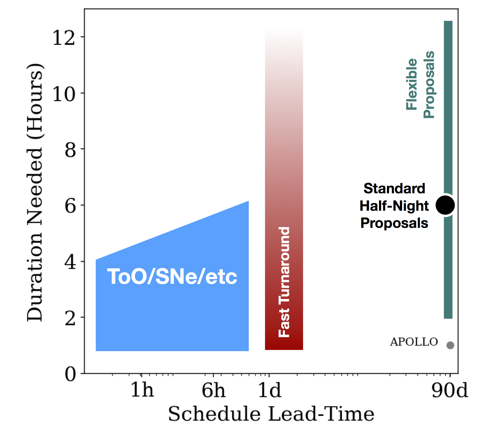

# tdawg-fig
A figure showing the parameter space to consider for scheduling time-sensitive observations at APO

Created for the [APO Time Domain Astronomy Working Group (TDAWG) report](https://sites.google.com/a/uw.edu/tdawg/)

